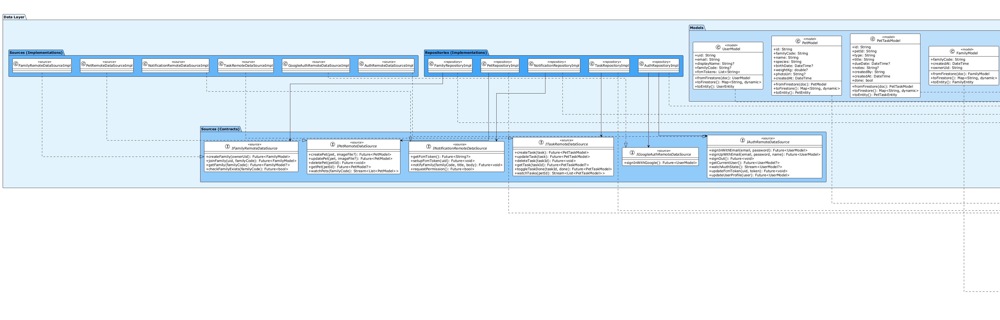
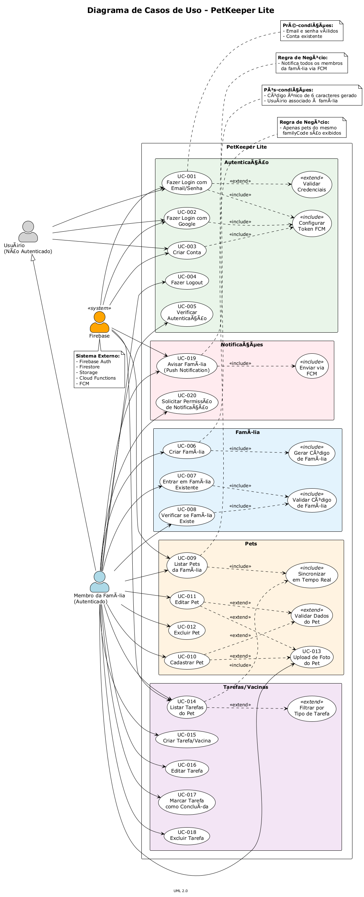
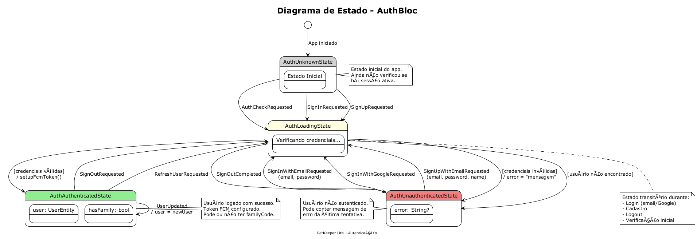
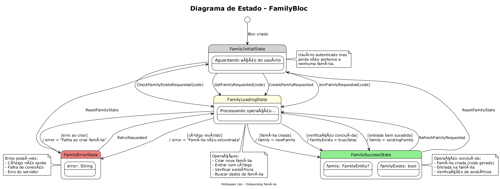
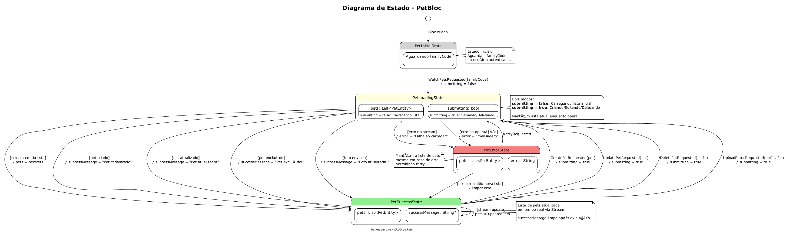
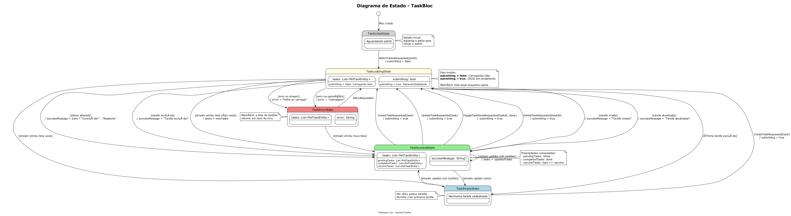
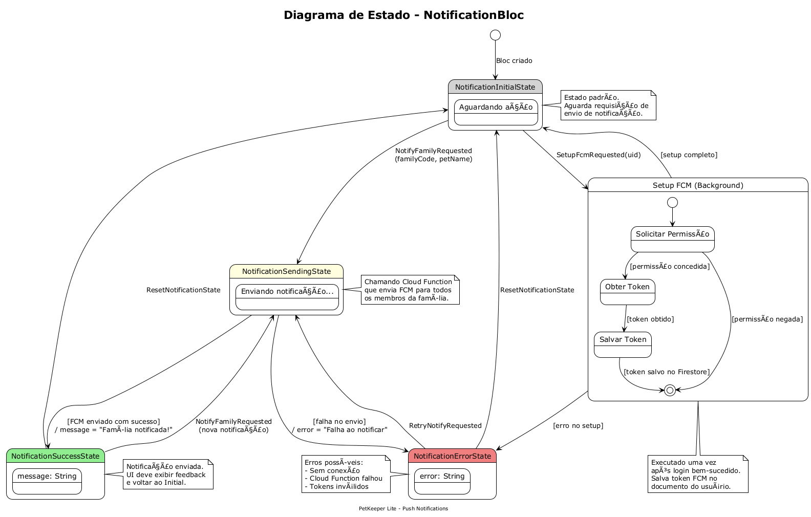

# PetKeeper Lite

App consumidor para cadastro compartilhado de pets e controle básico de vacinas/tarefas, com foto e sincronização em tempo real.

## Funcionalidades

- **Autenticação**: Firebase Auth (email/senha + Google Sign-In)
- **Pets (Firestore)**: CRUD completo de pets (nome, espécie, data de nascimento, peso)
- **Foto do pet (Storage)**: Upload e exibição com cache
- **Vacinas/Tarefas (Firestore)**: Adicionar, editar, marcar como concluída
- **Compartilhamento simples**: Código de família para sincronizar dados entre membros
- **Notificação push (FCM)**: Botão "Avisar família" envia push para todos os membros
- **Sync em tempo real**: Listas atualizadas ao vivo via Firestore Streams

## Arquitetura

O projeto utiliza **Clean Architecture** com as seguintes camadas:

```
lib/
├── core/
│   ├── di/                 # Injeção de dependências (GetIt)
│   ├── error/              # Failures e Exceptions
│   ├── helpers/            # Funções auxiliares
│   ├── router/             # Configuração do GoRouter
│   └── usecases/           # UseCase base class
├── data/
│   ├── models/             # Models com conversão Firestore
│   ├── repositories/       # Implementações dos repositórios
│   └── sources/            # Contratos e implementações de acesso ao Firebase
├── domain/
│   ├── entities/           # Entidades de negócio
│   ├── repositories/       # Contratos abstratos
│   └── usecases/           # Casos de uso da aplicação
└── presentation/
    ├── auth/               # Login, Registro (Bloc)
    ├── common/             # Widgets compartilhados
    ├── family/             # Onboarding família (Bloc)
    ├── notification/       # Notificações push (Bloc)
    ├── pets/               # CRUD de pets (Bloc)
    └── tasks/              # Vacinas/Tarefas (Bloc)
```

### Tecnologias Utilizadas

- **Flutter 3.x** com Dart
- **Bloc** para gerenciamento de estado
- **GoRouter** para navegação declarativa
- **GetIt** para injeção de dependências
- **Firebase**: Auth, Firestore, Storage, Functions, Messaging
- **Dartz** para programação funcional (`Either<Failure, Success>`)

### Trade-offs das Escolhas Tecnológicas

**Firebase é requisito do projeto, portanto trade-offs não foram realizados quanto ao back-end

| Tecnologia | Vantagens | Desvantagens | Alternativas Consideradas |
|------------|-----------|--------------|---------------------------|
| **Bloc** | Separação clara de lógica e UI; testabilidade alta; padrão previsível com eventos/estados; suporte a streams | Mais boilerplate que outras soluções; curva de aprendizado inicial | Provider|
| **GoRouter** | Navegação declarativa; deep linking nativo; integração com `go_router_builder` para type-safety; redirecionamentos fáceis | Menos flexível para navegação imperativa complexa; documentação às vezes desatualizada | Navigator 2.0 puro, AutoRoute |
| **GetIt** | Service Locator simples e rápido; lazy initialization; sem dependência de contexto/widget | Não é DI real (não resolve dependências automaticamente); pode virar "God Container" se mal usado | Injectable, Riverpod, Provider |
| **Dartz** | `Either<L, R>` para tratamento explícito de erros; programação funcional idiomática; elimina exceções não tratadas | Sintaxe verbosa; curva de aprendizado para quem não conhece FP; biblioteca não mais mantida ativamente | fpdart, result_dart, Result pattern manual |

> **Decisão geral**: Priorizei **previsibilidade** e **testabilidade** sobre simplicidade inicial. O custo de boilerplate do Bloc compensa em projetos médios/grandes onde debugging e manutenção são críticos.

## Apresentação do Projeto

[Link para apresentação](https://drive.google.com/drive/folders/1ZyJ54CWpaur7nLk3eI5E-5j0XmPBEk8-?usp=sharing)

## Setup do Projeto

### Pré-requisitos

- Flutter SDK 3.10+
- Node.js 20+
- Firebase CLI (`npm install -g firebase-tools`)
- FlutterFire CLI (`dart pub global activate flutterfire_cli`)

### 1. Clonar o repositório

```bash
git clone https://github.com/DanielBrown1998/pet_keeper_lite.git
cd pet_keeper_lite
```

### 2. Configurar Firebase

1. Crie um projeto no [Firebase Console](https://console.firebase.google.com/)

2. Ative os seguintes serviços:
   - Authentication (Email/Password e Google)
   - Firestore Database
   - Storage
   - Cloud Functions
   - Cloud Messaging

3. Configure o FlutterFire:

```bash
cd app
flutterfire configure
```

Isso gerará o arquivo `lib/firebase_options.dart` com suas credenciais.

### 3. Configurar Android

Para Google Sign-In no Android:

1. Adicione a SHA-1 do seu app no Firebase Console
2. Baixe o `google-services.json` atualizado
3. Coloque em `app/android/app/google-services.json`

```bash
# Gerar SHA-1
cd app/android
./gradlew signingReport
```

### 4. Configurar iOS (opcional)

1. Baixe `GoogleService-Info.plist` do Firebase Console
2. Coloque em `app/ios/Runner/GoogleService-Info.plist`
3. Configure URL Schemes no Xcode para Google Sign-In

### 5. Instalar dependências

```bash
# Flutter
cd app
flutter pub get

# Cloud Functions
cd ../functions
npm install
```

### 6. Deploy das Security Rules

```bash
# Na raiz do projeto
firebase deploy --only firestore:rules,storage:rules
```

### 7. Deploy das Cloud Functions

```bash
cd functions
npm run build
firebase deploy --only functions
```

## 🧪 Executando com Emuladores

Para desenvolvimento local sem afetar produção:

```bash
# Terminal 1: Iniciar emuladores Firebase
firebase emulators:start

# Terminal 2: Executar o app Flutter
cd app
flutter run
```

**Nota**: Para usar emuladores, altere a flag no `main.dart`:

```dart
/// Set to true to use Firebase emulators
const bool useEmulators = true;

/// Your local machine IP address (for physical devices)
/// Run 'ipconfig' (Windows) or 'ifconfig' (Mac/Linux) to find it
const String localMachineIp = 'your address IPv4';
```

A configuração dos emuladores é feita automaticamente com base na plataforma:
- **Android físico**: usa `localMachineIp`
- **iOS Simulator / Desktop**: usa `localhost`

## 📱 Executando o App

```bash
cd app

# Android
flutter run -d android

# iOS
flutter run -d ios

# Com hot reload
flutter run
```

## Configurando Push Notifications

### Android

O FCM já está configurado. Certifique-se de ter o `google-services.json`.

### iOS

1. Configure APNs no Apple Developer Portal
2. Faça upload da chave APNs no Firebase Console
3. Adicione capabilities no Xcode: Push Notifications e Background Modes

## Estrutura de Dados

### Firestore Collections

```
users/{uid}
├── displayName: string
├── email: string
├── familyCode: string
└── fcmTokens: string[]

families/{familyCode}
├── createdAt: timestamp
└── ownerUid: string

pets/{petId}
├── familyCode: string
├── name: string
├── species: string ("dog"|"cat"|"bird"...)
├── birthDate: timestamp?
├── weightKg: number?
├── photoUrl: string?
└── createdAt: timestamp

pet_tasks/{taskId}
├── petId: string
├── type: string ("vaccine"|"grooming"|"other")
├── title: string
├── dueDate: timestamp?
├── notes: string?
├── createdBy: string
├── createdAt: timestamp
└── done: boolean
```

## Segurança

### Firestore Rules

- Usuários só acessam seu próprio documento
- Pets e tarefas são isolados por `familyCode`
- Validação de `familyCode` em todas as operações

### Storage Rules

- Upload limitado a 5MB
- Apenas imagens aceitas
- Requer autenticação

### Melhorias Futuras Sugeridas

- Custom Claims para validação server-side do `familyCode`
- Rules mais estritas em `pet_tasks` validando ownership do pet
- Rate limiting nas Cloud Functions

## Fluxos de UX

1. **Onboarding** → Criar ou entrar com `familyCode`
2. **Lista de Pets** → Stream em tempo real
3. **Detalhe do Pet** → Ver info + CRUD de vacinas/tarefas
4. **Avisar Família** → Push notification para todos os membros

## Testes

O projeto inclui testes unitários, de Bloc e de Widget organizados na pasta `test/`:

```
test/
├── bloc/
│   └── auth_bloc_test.dart       # Testes do AuthBloc (estados e eventos)
├── unit/
│   └── pet_entity_test.dart      # Testes das entidades de domínio
└── widget/
    ├── login_page_test.dart      # Testes da tela de login
    └── pets_list_page_test.dart  # Testes da lista de pets
```

### Executar Testes

```bash
cd app

# Executar todos os testes
flutter test

# Executar com cobertura
flutter test --coverage

# Executar testes específicos
flutter test test/bloc/
flutter test test/unit/
flutter test test/widget/
```

## Vídeo de Demonstração

[Link do vídeo aqui - máximo 8 minutos]

Demonstra:
1. Login com email/senha e Google
2. Criar/entrar em família com código
3. CRUD de pets com foto
4. CRUD de vacinas/tarefas em tempo real
5. Push notification "Avisar Família"

## Licença

MIT License - veja [LICENSE](LICENSE) para detalhes.


## Como Usei o Cursor

### Prompts Utilizados

#### 1. PROMPT

De acordo com os requisitos, prepare um projeto com base no Clean Code, utilizando Clean Architecture, Bloc para gerenciamento de estado, GoRouter para navegação e GetIt para injeção de dependência. Apenas estruture-o e insira as dependências necessárias para utilizar FCM, Firebase Auth (OAuth Google e email/senha), Firestore e Storage.

---

#### 2. PROMPT

Você quebrou alguns princípios do SOLID:

- **Bloc contém lógica e gerencia o estado** (violou o SRP)
- **O Repository Pattern está inserido diretamente no Bloc** (violou o ISP) e chamando o Firestore e outros recursos diretamente (o papel do Repository Pattern é apenas indicar qual source utilizar: remoto ou local)

**Para resolver:**
- Crie os casos de uso listados na documentação presente no contexto e mova a lógica para lá
- Ponha os arquivos do caso de uso na pasta `domain`
- Crie também uma pasta `source` em `data` (com contrato e implementação para acessar o Firebase)

**Outro detalhe:**
- Repositórios retornam as entidades anêmicas
- Sources retornam os Models

**Ademais**, você também não instanciou todos os Blocs no topo da árvore com o `BlocProvider`. Utilize o GetIt apenas para instanciar os sources, repositories e usecases. Os Blocs ficarão no topo da árvore e receberão suas dependências buscando as instâncias no GetIt (tudo lazy).

> **Ajuste manual:** Apesar das instruções, o agente criou as dependências no `main` diretamente. Coloquei todos dentro do `BlocProvider` para tornarem-se lazy e não prejudicar a inicialização do app. Alguns widgets continham lógica de negócio diretamente na UI; criei novos casos de uso para implementar essa lógica.

---

#### 3. PROMPT

Os estados do Bloc estão definidos com um `enum` dentro de seus respectivos `state`. Defina uma `sealed class` e, a partir dos tipos `AuthUnknownState`, `AuthLoadingState`, `AuthAuthenticatedState`, etc., defina o status da autenticação, o usuário (se houver) e o erro (caso haja).

<details>
<summary><strong>O que foi ajustado</strong></summary>

**ANTES:**

```dart
enum AuthStatus { unknown, authenticated, unauthenticated, loading }

class AuthState extends Equatable {
  final AuthStatus status;
  final UserEntity? user;
  final String? error;

  const AuthState({this.status = AuthStatus.unknown, this.user, this.error});

  const AuthState.unknown() : this();

  const AuthState.loading() : this(status: AuthStatus.loading);

  const AuthState.authenticated(UserEntity user)
    : this(status: AuthStatus.authenticated, user: user);

  const AuthState.unauthenticated([String? error])
    : this(status: AuthStatus.unauthenticated, error: error);

  bool get isAuthenticated => status == AuthStatus.authenticated;
  bool get isLoading => status == AuthStatus.loading;
  bool get hasFamily =>
      user?.familyCode != null && user!.familyCode!.isNotEmpty;

  AuthState copyWith({AuthStatus? status, UserEntity? user, String? error}) {
    return AuthState(
      status: status ?? this.status,
      user: user ?? this.user,
      error: error ?? this.error,
    );
  }

  @override
  List<Object?> get props => [status, user, error];
}
```

**DEPOIS:**

```dart
sealed class AuthState extends Equatable {
  const AuthState();

  /// Retorna o usuário se estiver autenticado, null caso contrário
  UserEntity? get user => null;

  /// Retorna o erro se houver, null caso contrário
  String? get error => null;

  /// Verifica se o usuário está autenticado
  bool get isAuthenticated => this is AuthAuthenticatedState;

  /// Verifica se está carregando
  bool get isLoading => this is AuthLoadingState;

  /// Verifica se o usuário pertence a uma família
  bool get hasFamily =>
      user?.familyCode != null && user!.familyCode!.isNotEmpty;
}

/// Estado inicial - ainda não verificou autenticação
final class AuthUnknownState extends AuthState {
  const AuthUnknownState();

  @override
  List<Object?> get props => [];
}

/// Estado de carregamento durante operações de autenticação
final class AuthLoadingState extends AuthState {
  const AuthLoadingState();

  @override
  List<Object?> get props => [];
}

/// Estado autenticado com usuário logado
final class AuthAuthenticatedState extends AuthState {
  @override
  final UserEntity user;

  const AuthAuthenticatedState(this.user);

  @override
  List<Object?> get props => [user];
}

/// Estado não autenticado, opcionalmente com mensagem de erro
final class AuthUnauthenticatedState extends AuthState {
  @override
  final String? error;

  const AuthUnauthenticatedState([this.error]);

  @override
  List<Object?> get props => [error];
}
```

</details>

> **Ajuste manual do Prompt 3:**
> - Algumas classes continham fluxos confusos e, devido à stream sempre ativa, poderia haver race conditions no app. Simplifiquei o fluxo para apenas alguns estados, mantendo o debug simples de acordo com o KISS (código simples é mais fácil de manter, testar e debugar).
> - Outro fator foi criar um Bloc único para notificação, já que possui outra responsabilidade. O agente o colocou dentro do `PetBloc`, então toda vez que eu tentava emitir uma notificação, era como se o `PetBloc` estivesse sendo atualizado, ferindo o SRP.
> - Também alterei as dependências para receberem somente classes abstratas (contratos) de acordo com o DIP. Algumas continham implementações concretas e outras instanciavam diretamente algumas classes, o que dificultaria os testes, já que os mocks tornar-se-iam inúteis nesse caso.

---

#### 4. PROMPT

Todos esses widgets selecionados deveriam ser classes de widgets, e não funções. O Flutter deve renderizá-los e criar seu próprio element na árvore de elementos. Do modo como está, o app terá menos performance. Então, escreva esses widgets em uma pasta `widgets` dentro de `pets/pages/widgets` e mova suas dependências para lá também (como algum dialog ou código síncrono).

```dart
Widget _buildAppBar(BuildContext context, PetEntity pet) {}
Widget _buildPetInfo(BuildContext context, PetEntity pet) {}
Widget _buildInfoRow(IconData icon, String label, String value) {}
Widget _buildTasksSection(BuildContext context) {}
Widget _buildTaskItem(BuildContext context, PetTaskEntity task) {}
Widget _buildTaskTypeChip(TaskType type) {}
void _showDeleteDialog(BuildContext context) {}
void _showNotifyDialog(BuildContext context, PetEntity pet) {}
```

> **O problema de declarar widgets através de funções:** Declarar widgets dessa forma no Flutter acarretará perda de performance, porquanto, ao utilizar o `setState` no topo, todos os widgets serão passíveis de rebuild. O Framework verificará cada um deles, já que são filhos do widget que fora marcado como "sujo" na árvore.


> **O problema de declarar widgets através de funções:** Declarar widgets dessa forma no Flutter acarretará perda de performance, porquanto, ao utilizar o `setState` no topo, todos os widgets serão passíveis de rebuild. O Framework verificará cada um deles, já que são filhos do widget que fora marcado como "sujo" na árvore.

> **Ajuste manual do Prompt 4:**
> Utilizei o pattern Simple Factory para decidir se o carregamento seria do widget pet_create_form ou pet_edit_form no pet_form_page; o mesmo fiz no task_form_page.  

---

## Diagramas UML

Diagramas gerados seguindo a especificação UML 2.0. Arquivos fonte em [docs/uml/](docs/uml/).

📄 **[Descrição Completa dos Casos de Uso](docs/uml/use_cases_description.md)** - Documentação detalhada com fluxos, regras de negócio e matriz de rastreabilidade.

### Diagrama de Classes



### Diagrama de Casos de Uso



### Diagramas de Estado

#### AuthBloc


#### FamilyBloc


#### PetBloc


#### TaskBloc


#### NotificationBloc



